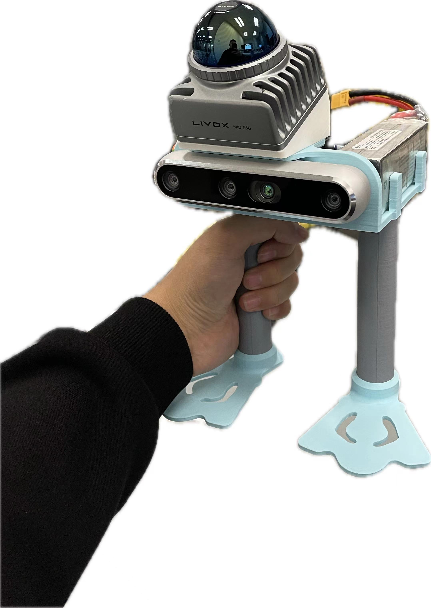

# LVIO-Lite

Based on the [LIO-Lite](https://github.com/Liansheng-Wang/LIO-Lite.git) project, visual rendering has been added

## Vision-Lidar Calibration
Designed a camera-lidar calibration tool for checkerboard calibration board.
The URL of the code: [SensorCalibration](https://github.com/Liansheng-Wang/SensorCalibration.git)

## Data acquisition equipment
Camera: D455, Lidar:  Mid-360  

    

  

    

## experimental results

<!-- 第一行，两张正方形图片 -->

  
  

<!-- 第二行，两张正方形图片 -->

  
  

<!-- 第三行，第一张长图 -->

  

<!-- 第四行，第二张长图 -->

  

