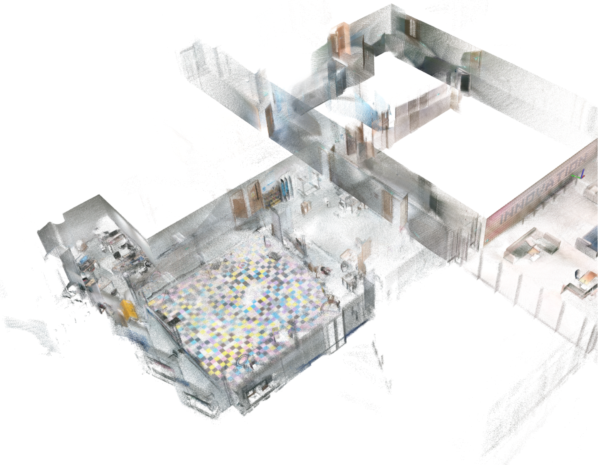

# LVIO-Lite

Based on the [LIO-Lite](https://github.com/Liansheng-Wang/LIO-Lite.git) project, visual rendering has been added

## Vision-Lidar Calibration
Designed a camera-lidar calibration tool for checkerboard calibration board.
The URL of the code: [SensorCalibration](https://github.com/Liansheng-Wang/SensorCalibration.git)

## Data acquisition equipment
Camera: D455, Lidar:  Mid-360  
<table  align="center">
  <!-- 第一行和第二行，每行两张正方形图片 -->
  <tr>
    <td></td>
    <td></td>
    <td></td>
  </tr>
</table>

## experimental results

<!-- 使用表格来创建网格布局 -->
<table align="center">
  <!-- 第一行和第二行，每行两张正方形图片 -->
  <tr>
    <td></td>
    <td></td>
  </tr>
  <tr>
    <td></td>
    <td></td>
  </tr>

  <!-- 第三行，第一张长图 -->
  <tr>
    <td colspan="2"></td>
  </tr>

  <!-- 第四行，第二张长图 -->
  <tr>
    <td colspan="2"></td>
  </tr>
</table>
